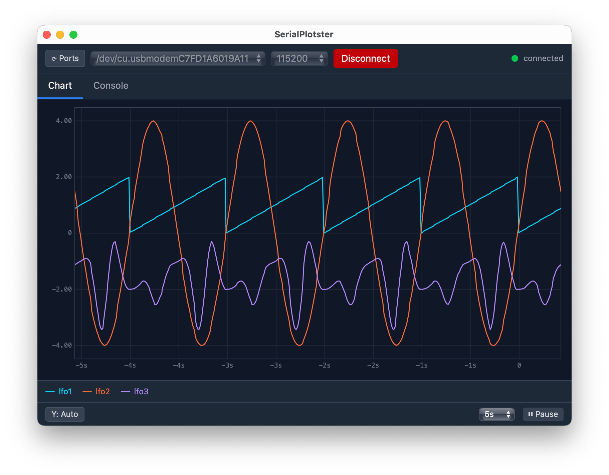

# SerialPlotster

A cross-platform desktop serial plotter built with [Tauri 2](https://tauri.app). Graphs line-oriented numeric data from a serial port as a real-time strip chart, with scrub/zoom that does not pause data collection, plus a console pane for bidirectional communication with the device.




## Features

- **Live strip chart** — canvas-based renderer driven by `requestAnimationFrame`, no charting library
- **Non-blocking scrub/zoom** — drag or trackpad-swipe to pan through history while data keeps arriving; Ctrl+scroll or pinch to zoom; double-click to snap back to live
- **Auto-scaling Y axis** — scales to the visible window, not all-time extremes
- **Multi-series** — up to 8 colour-coded series; click legend swatches to toggle visibility
- **Flexible parser** — comma, tab, or space delimited; Arduino-style `label:value` pairs; `# header` lines for series names; malformed lines silently skipped
- **Console pane** — scrolling RX/TX log with timestamps; send field with configurable line ending
- **Mock stream** — built-in synthetic sin/cos/noise source for development without hardware

## Supported data formats

Any line-oriented text where each line contains numbers:

```
1.23,4.56,7.89          # comma-separated
1.23  4.56  7.89        # space-separated
1.23\t4.56\t7.89        # tab-separated
temp:23.5,hum:45.2      # Arduino label:value pairs
# temperature humidity  # header line — sets series names
```

## Stack

| Concern | Choice |
|---|---|
| Framework | Tauri 2 |
| Frontend | React 19 + TypeScript + Vite |
| Styling | Tailwind CSS v4 |
| Charting | Custom canvas rendering |
| Serial | `tauri-plugin-serialplugin` + `serialport` crate |

## Development

### Prerequisites

- [Rust](https://rustup.rs) (stable)
- [Node.js](https://nodejs.org) 18+
- Tauri CLI prerequisites for your platform — see [Tauri docs](https://tauri.app/start/prerequisites/)

### Run

```bash
npm install
npm run tauri dev
```

### Build

```bash
npm run tauri build
```

### Clean

```bash
npm run clean        # removes dist/ and src-tauri/target/
```

### Tests

```bash
cd src-tauri && cargo test     # Rust parser unit tests
```

See [TESTING.md](TESTING.md) for how to exercise the Tauri commands and events from the browser devtools console.

## Project structure

```
src/
  App.tsx
  components/
    Header.tsx          — port picker, baud, connect/disconnect, status pill
    TabNav.tsx          — Chart | Console tabs
    PlotCanvas.tsx      — canvas rendering, rAF loop, scrub/zoom
    PlotToolsOverlay.tsx — pause/resume, time-window selector
    Legend.tsx          — series names + colour swatches, toggle visibility
    ConsolePane.tsx     — wraps ConsoleLog + ConsoleInput
    ConsoleLog.tsx      — scrolling RX/TX list with timestamps
    ConsoleInput.tsx    — text field + line-ending picker + send button
  hooks/
    useSerialBackend.ts — Tauri command wrappers + event subscriptions
    useRingBuffer.ts    — ring store as a React hook
  store/
    RingStore.ts        — per-series Float32Array ring buffer + Float64Array timestamps
    ConsoleStore.ts     — bounded list of RX/TX lines
  types/
    serial.ts           — TypeScript types matching Rust event payloads

src-tauri/src/
  lib.rs               — serial commands, read loop, line parser, mock stream
```


## Links and notes

- This project was created with the help of claude code
- Heavily inspired by https://github.com/atomic14/web-serial-plotter


## License

MIT
